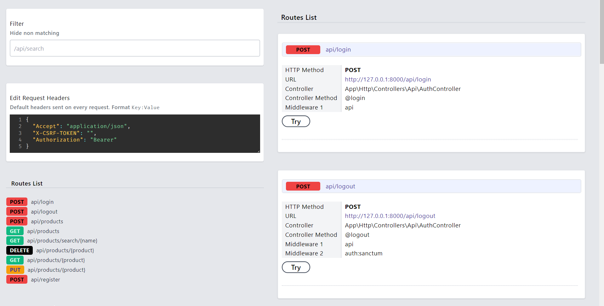

# Larapi — My First REST API Using Laravel

This project was completed within a few hours. I know a lot of things can be implemented. Am learning to build and play with APIs in Laravel.



## Documentation

Run this project in your local server, then navigate to `/request-docs` for more documentation. documentation was generated using [Laravel Request Docs](https://github.com/rakutentech/laravel-request-docs) package.

**Run this project to learn more about request/response!**

## How To Use

1. Clone this repository

```bash
git clone https://github.com/alnahian2003/larapi.git
```

2. Install all the dependencies using composer and npm

```bash
composer install
```

3. Copy the example env file and make the required configuration changes in the `.env` file

```bash
cp .env.example .env
```

4. Generate a new application key

```bash
php artisan key:generate
```

5. Run the database migrations (Set the database connection in `.env` before migrating)

```bash
php artisan migrate
```

6. Start the local development server

```bash
php artisan serve
```

**Enjoy!**
